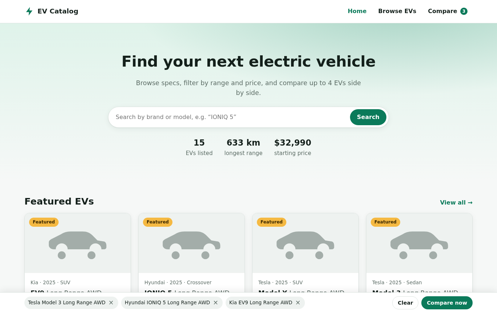

# EV Catalog

A complete, deployable electric-vehicle catalog website: browse and filter EVs, view full specifications, compare up to 4 EVs side by side, and manage everything from a role-based admin dashboard.

**Stack:** PHP 8.0+ (no framework, no Composer), MySQL / MariaDB, vanilla JS and CSS (no build step). It is built to upload straight to **cPanel** shared hosting.



## Features

**Public site**
- Home page with a hero search, live stats, featured EVs, and browsing by body type and by brand
- Catalog with instant filters (search, brand, body type, drivetrain, price, range, seats, DC charging), 8 sort orders, grid or table view, pagination, and shareable URLs
- EV detail page with key stats, grouped full specifications and similar EVs
- Side-by-side comparison of 2–4 EVs with the best value highlighted per row, a "differences only" toggle, autocomplete to add EVs, shareable `/compare?ids=…` links, and a persistent compare tray
- Responsive at mobile, tablet and desktop sizes, with dark mode and accessibility built in

**Admin dashboard** (`/admin`)
- Dashboard with stats, charts and recent activity
- EVs: full create, edit and delete, bulk publish/unpublish/feature/delete, image upload, draft or published status, featured flag
- Brands, users and roles (**admin** / **editor**), site settings, activity log, and a change-password page
- Every change is written to MySQL immediately and is live on the website on the next page load (no caching layer)

**Security:** bcrypt passwords, forced change of the default password, CSRF tokens, prepared statements, login throttling, session hardening, role checks on every endpoint, validated image-only uploads with PHP execution blocked, and internal folders blocked by `.htaccess`.

## Repository layout

```
ev-site/                  ← the website: upload its CONTENTS to cPanel public_html
  index.php               front controller (pages and /api/*)
  .htaccess               routing and access rules
  config.sample.php       → copy to config.php   (or .env.example → .env)
  app/Core/               Router, Request, Response, Database (PDO), Auth, Session, Validator, Audit
  app/Controllers/        PageController, PublicApiController, AuthController, Admin/*
  app/Repositories/       VehicleRepository (search, filters), SettingsRepository
  app/routes.php          all routes and their permission middleware
  views/                  PHP templates (layout, home, catalog, detail, compare, admin shell)
  assets/css, assets/js   app.css/app.js (public), admin.css/admin.js (admin SPA)
  uploads/                image uploads (script execution disabled)
database/ev_catalog.sql   MySQL schema, seed data and default admin
docs/                     deployment guide, API reference, DB schema, wireframes, components
tests/smoke.sh            47-check end-to-end API test
build.sh                  builds dist/ev-catalog-cpanel.zip
```

## Deliverables

| Deliverable | Where |
|---|---|
| **A. Front-end:** UI wireframes | [docs/WIREFRAMES.md](docs/WIREFRAMES.md) (all pages × mobile, tablet and desktop, plus screenshots) |
| Component list | [docs/COMPONENTS.md](docs/COMPONENTS.md) |
| Responsive layout | `ev-site/assets/css/*.css` (mobile-first, breakpoints at 640, 768, 1024 and 1280px) |
| **B. Back-end:** API endpoints (EV list, detail, compare, admin CRUD, auth and roles) | [docs/API.md](docs/API.md), `ev-site/app/routes.php` |
| Database schema (MySQL) | [database/ev_catalog.sql](database/ev_catalog.sql), [docs/DATABASE.md](docs/DATABASE.md) |
| Admin dashboard | `/admin` → `ev-site/assets/js/admin.js` |
| **C. Integration:** front-end connected to the back-end, admin changes live instantly | Front-end JS consumes `/api/*`; no cache; verified by `tests/smoke.sh` |
| cPanel deployable (PHP + MySQL) | `ev-site/` |
| **D. Deployment package:** ready-to-upload folder | `ev-site/`, or run `./build.sh` → `dist/ev-catalog-cpanel.zip` |
| SQL database file | `database/ev_catalog.sql` |
| cPanel config instructions | [docs/DEPLOYMENT.md](docs/DEPLOYMENT.md) |
| `.env` / `config.php` setup | `ev-site/config.sample.php`, `ev-site/.env.example` |

## Deploy to cPanel (summary)

1. Create a MySQL database and user in cPanel, then import `database/ev_catalog.sql` in phpMyAdmin.
2. Upload the contents of `ev-site/` to `public_html/`, including `.htaccess`.
3. Copy `config.sample.php` to `config.php` and enter your database credentials.
4. Select PHP 8.1 or newer in MultiPHP Manager.
5. Open `/admin` and sign in with `admin@example.com` / `ChangeMe123!`. You must choose a new password straight away.

Full step-by-step guide with troubleshooting: **[docs/DEPLOYMENT.md](docs/DEPLOYMENT.md)**.

## Run locally

```bash
# 1. Database
mysql -uroot -e "CREATE DATABASE evcatalog CHARACTER SET utf8mb4"
mysql -uroot evcatalog < database/ev_catalog.sql

# 2. Config
cp ev-site/config.sample.php ev-site/config.php   # then edit the db section

# 3. Serve (PHP's built-in server ignores .htaccess, so use the router script)
php -S localhost:8080 -t ev-site tests/dev-router.php

# 4. Test (on a freshly imported database)
tests/smoke.sh http://localhost:8080
```

## License

MIT. See [License.txt](License.txt).
