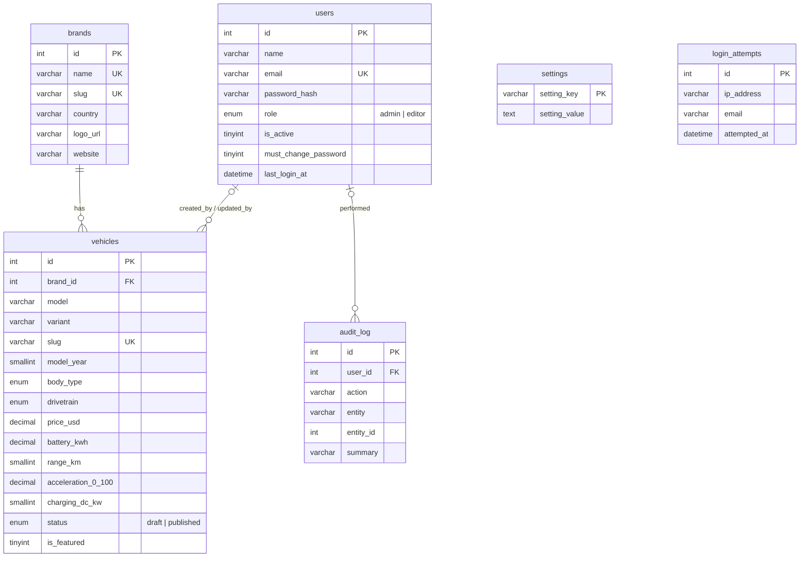

# Database schema (MySQL / MariaDB)

Source: [`database/e-carscompare.sql`](../database/e-carscompare.sql). InnoDB, `utf8mb4_unicode_ci`, compatible with MySQL 5.7+ and MariaDB 10.3+.

## Tables

### `vehicles`

| Column | Type | Notes |
|---|---|---|
| id | INT UNSIGNED PK AI | |
| brand_id | INT UNSIGNED FK → brands.id | `ON DELETE RESTRICT`, so a brand cannot be removed while it has EVs |
| model, variant | VARCHAR(120) | |
| slug | VARCHAR(190) UNIQUE | Used in `/ev/{slug}` URLs |
| model_year | SMALLINT | |
| body_type | ENUM | sedan, suv, hatchback, crossover, pickup, van, coupe, wagon |
| drivetrain | ENUM | FWD, RWD, AWD |
| price_usd | DECIMAL(10,2) NULL | Shown with the currency symbol from settings |
| battery_kwh | DECIMAL(6,1) NULL | Usable capacity |
| range_km | SMALLINT NULL | WLTP |
| efficiency_wh_km | SMALLINT NULL | |
| acceleration_0_100 | DECIMAL(4,1) NULL | Seconds |
| top_speed_kmh, power_kw, torque_nm | SMALLINT NULL | |
| seats | TINYINT NULL | |
| charging_ac_kw | DECIMAL(5,1) NULL | |
| charging_dc_kw, charge_10_80_min | SMALLINT NULL | |
| cargo_l, weight_kg | SMALLINT NULL | |
| image_url | VARCHAR(500) NULL | Absolute URL or `/uploads/...` |
| description | TEXT NULL | |
| status | ENUM('draft','published') | Only `published` rows appear on the public site and API |
| is_featured | TINYINT(1) | Shown in the homepage "Featured" row |
| created_by, updated_by | FK → users.id | `ON DELETE SET NULL` |
| created_at, updated_at | DATETIME | `updated_at` updates automatically |

Indexes: `brand_id`, `status`, `price_usd`, `range_km`, `body_type`, unique `slug`.

### `brands`

`id`, `name` (unique), `slug` (unique), `country`, `logo_url`, `website`, and timestamps.

### `users`

`id`, `name`, `email` (unique, stored lowercase), `password_hash` (bcrypt via `password_hash()`), `role` (`admin` or `editor`), `is_active`, `must_change_password`, `last_login_at`, and timestamps.

### `settings`

A key/value store edited on the admin **Site settings** page: `site_name`, `site_tagline`, `contact_email`, `currency_symbol`, `hero_title`, `hero_subtitle`, `footer_text`, `max_compare`, `items_per_page`.

### `audit_log`

One row per admin action (login, logout, create, update, delete, bulk actions, uploads, password changes, settings changes), recording the user, IP address and a readable summary.

### `login_attempts`

Failed logins, used for throttling (5 failures per IP in 15 minutes returns 429). The table is cleared for an IP after a successful login, and rows older than a day are pruned.

## Seed data

- 1 admin: `admin@e-carscompare.com` / `ChangeMe123!`, forced to change the password at first login
- 10 brands, 16 EVs (15 published and 1 draft), with indicative sample specs
- Default settings

## Backups

cPanel → phpMyAdmin → select the database → **Export** → Quick → SQL. Or use cPanel **Backup** / JetBackup.
