# UI wireframes

Low-fidelity wireframes for every screen at the three target breakpoints, followed by screenshots of the built UI.

| Breakpoint | Width | Grid |
|---|---|---|
| **Mobile** | < 640px (tested at 390px) | 1 card column; filters in an off-canvas drawer; hamburger nav |
| **Tablet** | 640–1023px (tested at 820px) | 2 card columns; filters still in a drawer; inline nav from 768px |
| **Desktop** | ≥ 1024px (tested at 1366–1440px) | 3–4 card columns; sticky filter sidebar (280px) |

No page scrolls horizontally at any of these widths (verified automatically). Only the comparison table and the table view scroll sideways, inside their own container.

---

## 1. Home `/`

**Desktop**
```
┌──────────────────────────────────────────────────────────────────────────┐
│ ⚡ EV Catalog                               Home  Browse EVs  Compare (3)│  ← sticky header
├──────────────────────────────────────────────────────────────────────────┤
│                   Find your next electric vehicle                        │  ← hero (from settings)
│        Browse specs, filter by range and price, and compare…            │
│          ┌───────────────────────────────────────────┬────────┐          │
│          │ Search by brand or model…                 │ Search │          │  → /evs?q=
│          └───────────────────────────────────────────┴────────┘          │
│                 15 EVs listed   633 km longest   $32,990 from            │  ← live stats
├──────────────────────────────────────────────────────────────────────────┤
│ Featured EVs                                                  View all → │
│ ┌──────────┐ ┌──────────┐ ┌──────────┐ ┌──────────┐                      │
│ │[Featured]│ │  image   │ │  image   │ │  image   │   ← EV card ×4       │
│ │  image   │ │          │ │          │ │          │     (is_featured=1)  │
│ │Kia·2025· │ │ …        │ │ …        │ │ …        │                      │
│ │EV9 LR AWD│ │          │ │          │ │          │                      │
│ │$63,900   │ │          │ │          │ │          │                      │
│ │489km|6s| │ │          │ │          │ │          │                      │
│ │☐ Compare │ │☐ Compare │ │☐ Compare │ │☐ Compare │                      │
│ └──────────┘ └──────────┘ └──────────┘ └──────────┘                      │
├──────────────────────────────────────────────────────────────────────────┤
│ Browse by body type                                                      │
│ (Sedan) (SUV) (Hatchback) (Crossover) (Pickup) (Van) (Coupe) (Wagon)     │  ← chips → /evs?body_type=
├──────────────────────────────────────────────────────────────────────────┤
│ Browse by brand                                                          │
│ ┌───────┐┌───────┐┌───────┐┌───────┐┌───────┐                            │
│ │BMW    ││BYD    ││Ford   ││Hyundai││Kia    │  ← brand tiles (5 cols)    │
│ │2 EVs  ││2 EVs  ││2 EVs  ││2 EVs  ││2 EVs  │    → /evs?brand=           │
│ └───────┘└───────┘└───────┘└───────┘└───────┘                            │
├──────────────────────────────────────────────────────────────────────────┤
│ © footer text (settings)                               hello@example.com │
└──────────────────────────────────────────────────────────────────────────┘
│ [Model 3 ×] [IONIQ 5 ×] [EV9 ×]                    (Clear) (Compare now) │  ← compare tray (fixed bottom,
└──────────────────────────────────────────────────────────────────────────┘     only when ≥1 selected)
```

**Mobile**
```
┌──────────────────────┐
│ ⚡ EV Catalog     ☰  │ ← menu opens a dropdown panel
├──────────────────────┤
│ Find your next       │
│ electric vehicle     │
│ ┌──────────────┬───┐ │
│ │ Search…      │ ⏎ │ │
│ └──────────────┴───┘ │
│ 15 EVs · 633km · $32k│
├──────────────────────┤
│ Featured EVs  View → │
│ ┌──────────────────┐ │
│ │ image            │ │ ← 1 column
│ │ EV9 Long Range   │ │
│ │ $63,900          │ │
│ │ 489km | 6s | 210 │ │
│ │ ☐ Compare        │ │
│ └──────────────────┘ │
│ … 3 more cards       │
│ (chips wrap)         │
│ ┌────────┐┌────────┐ │ ← brand tiles 2 cols
└──────────────────────┘
```

**Tablet:** same as mobile, but the nav is inline, cards use 2 columns and brand tiles use 3 columns.

---

## 2. Browse / catalog `/evs`

**Desktop**
```
┌──────────────────────────────────────────────────────────────────────────┐
│ header                                                                   │
├──────────────────────────────────────────────────────────────────────────┤
│ Browse electric vehicles                                                 │
│ 8 electric vehicles found                                                │
│ ┌──────────────┐  [SUV ×][Crossover ×][500+ km ×]   [Sort ▾] [▦][≡]     │ ← active-filter chips,
│ │ Filters      │  ┌──────────┐ ┌──────────┐ ┌──────────┐                 │   sort, grid/table toggle
│ │ Search [   ] │  │ EV card  │ │ EV card  │ │ EV card  │                 │
│ │ Brand        │  └──────────┘ └──────────┘ └──────────┘                 │
│ │ ☐ BMW     2  │  ┌──────────┐ ┌──────────┐ ┌──────────┐                 │
│ │ ☐ BYD     2  │  │ EV card  │ │ EV card  │ │ EV card  │                 │
│ │ Body type    │  └──────────┘ └──────────┘ └──────────┘                 │
│ │ ☑ SUV        │                                                         │
│ │ ☑ Crossover  │               ‹  1  [2]  3  …  6  ›                     │ ← pagination
│ │ Drivetrain   │                                                         │
│ │ ☐FWD ☐RWD ☐AWD                                                         │
│ │ Price [min]–[max]                                                      │
│ │ Min range ━━●━━ 500 km                                                 │
│ │ Min seats [Any ▾]                                                      │
│ │ Min DC kW [Any ▾]                                                      │
│ │ (Reset filters)                                                        │
│ └──────────────┘  ← sticky sidebar, 280px                                │
└──────────────────────────────────────────────────────────────────────────┘
```

**Table view** (the ≡ toggle) replaces the card grid:
```
┌───────────────────────┬──────┬────────┬───────┬────────┬──────┬─────┬─────┬─────────┐
│ EV                    │ Body │  Price │ Range │ Battery│0–100 │ DC  │Drive│ Compare │
├───────────────────────┼──────┼────────┼───────┼────────┼──────┼─────┼─────┼─────────┤
│ Kia EV9 Long Range AWD│ SUV  │ $63,900│ 489 km│ 99.8   │ 6 s  │ 210 │ AWD │   ☐     │
└───────────────────────┴──────┴────────┴───────┴────────┴──────┴─────┴─────┴─────────┘
```

**Mobile**
```
┌──────────────────────┐        ┌────────────────┬─────┐
│ Browse EVs           │        │ Filters      ✕ │░░░░░│ ← drawer slides in
│ 8 found              │  tap   │ Search [     ] │░░░░░│   from the left over
│ [⚙ Filters 3] [Sort▾]│ ─────► │ Brand ☐☐☐      │░░░░░│   a dimmed backdrop;
│ [SUV×][500+ km×]     │        │ Body  ☑☑       │░░░░░│   Esc or backdrop
│ ┌──────────────────┐ │        │ Price [ ]-[ ]  │░░░░░│   closes it
│ │ EV card          │ │        │ Range ━━●━━    │░░░░░│
│ └──────────────────┘ │        │ (Reset)        │░░░░░│
│ ‹ 1 [2] 3 ›          │        └────────────────┴─────┘
└──────────────────────┘
```

Filters apply instantly (no submit button). The URL updates (`/evs?body_type=suv&min_range=500`), so any filtered view can be shared or bookmarked.

---

## 3. EV detail `/ev/{slug}`

**Desktop**
```
┌──────────────────────────────────────────────────────────────────────────┐
│ Home / EVs / Hyundai / IONIQ 5                                           │ ← breadcrumb
│ ┌───────────────────────────────────┐  Hyundai · 2025 · Crossover        │
│ │                                   │  IONIQ 5 Long Range AWD            │
│ │            main image             │  From $52,600                      │
│ │             (16:10)               │  ┌───────┬───────┬───────┬───────┐ │
│ │                                   │  │ Range │0–100  │Battery│DC chg │ │ ← key stats
│ │                                   │  │507 km │5.1 s  │84 kWh │235 kW │ │
│ └───────────────────────────────────┘  └───────┴───────┴───────┴───────┘ │
│                                        [Add to compare] (Go to compare)  │
│                                        Description paragraph…            │
│ Full specifications                                                      │
│ ┌──────────────────┐ ┌──────────────────┐ ┌──────────────────┐           │
│ │ Overview         │ │ Battery & range  │ │ Charging         │  ← spec   │
│ │ Price    $52,600 │ │ Range     507 km │ │ DC       235 kW  │    groups │
│ │ Year        2025 │ │ Battery   84 kWh │ │ 10–80%   18 min  │    (3 col)│
│ │ Body   Crossover │ │ Effic. 178 Wh/km │ │ AC      10.9 kW  │           │
│ └──────────────────┘ └──────────────────┘ └──────────────────┘           │
│ ┌──────────────────┐ ┌──────────────────┐                                │
│ │ Performance      │ │ Practicality     │                                │
│ └──────────────────┘ └──────────────────┘                                │
│ Similar EVs                                                              │
│ [card] [card] [card] [card]                                              │
└──────────────────────────────────────────────────────────────────────────┘
```

**Mobile:** the image stacks above the summary, key stats show in a 2×2 grid, spec groups use 1 column (2 on tablet), and similar EVs use 1 column (2 on tablet).

---

## 4. Compare `/compare`

**Desktop**
```
┌──────────────────────────────────────────────────────────────────────────┐
│ Compare EVs                                                              │
│ Pick up to 4 EVs. Best values in each row are highlighted.               │
│ ┌───────────────────────────────┐   ☐ Show differences only              │
│ │ Add an EV… (autocomplete)     │                                        │
│ ├───────────────────────────────┤                                        │
│ │ Kia EV9 Long Range AWD        │ ← ↑/↓/Enter keyboard support           │
│ │   $63,900 · 489 km            │                                        │
│ └───────────────────────────────┘                                        │
│ ┌──────────────┬─────────────┬─────────────┬─────────────┬─────────────┐ │
│ │              │ [img]       │ [img]       │ [img]       │ ┌ ─ ─ ─ ─ ┐ │ │
│ │              │ Tesla M3    │ IONIQ 5     │ Kia EV9     │  Add another│ │ ← empty slot
│ │              │ Remove      │ Remove      │ Remove      │ └ ─ ─ ─ ─ ┘ │ │
│ ├──────────────┴─────────────┴─────────────┴─────────────┴─────────────┤ │
│ │ OVERVIEW                                                             │ │ ← group row
│ ├──────────────┬─────────────┬─────────────┬─────────────┬─────────────┤ │
│ │ Price        │▓$47,490 ★▓▓▓│ $52,600     │ $63,900     │             │ │ ← best = highlighted
│ │ Seats        │ 5           │ 5           │▓7 ★▓▓▓▓▓▓▓▓▓│             │ │
│ │ BATTERY & RANGE                                                      │ │
│ │ Range        │▓629 km ★▓▓▓▓│ 507 km      │ 489 km      │             │ │
│ │ …            │             │             │             │             │ │
│ └──────────────┴─────────────┴─────────────┴─────────────┴─────────────┘ │
└──────────────────────────────────────────────────────────────────────────┘
```

**Mobile**
```
┌──────────────────────┐
│ Compare EVs          │
│ [Add an EV…        ] │
│ ☐ Differences only   │
│ ┌────────┬────────┬──┼──►  the table scrolls sideways;
│ │        │ Model Y│IO│      the spec-label column is
│ │ Price  │$50,490 │$5│      sticky on the left
│ │ Range  │533 km  │50│
│ └────────┴────────┴──┼──►
└──────────────────────┘
```

The selection is stored in `localStorage` and survives page loads. The URL is `/compare?ids=1,3,6`, so a comparison can be shared: opening a shared link loads that selection.

---

## 5. Admin: login and forced password change `/admin`

```
┌──────────────────────────────┐      ┌──────────────────────────────┐
│ ⚡ EV Catalog admin           │      │ Choose a new password        │
│ Sign in                      │      │ ⚠ You must replace the       │
│ Email    [               ]   │ ───► │   temporary password…        │
│ Password [               ]   │ 1st  │ Current  [            ]      │
│ [          Sign in         ] │ login│ New      [            ]      │
│ ← Back to site               │      │ Confirm  [            ]      │
└──────────────────────────────┘      │ [Update password]  Sign out  │
                                      └──────────────────────────────┘
```

## 6. Admin: dashboard `#/dashboard`

```
┌────────────┬─────────────────────────────────────────────────────────────┐
│ ⚡ EV Cat.  │                              Jane Doe [ADMIN] (Sign out)    │ ← topbar
│            ├─────────────────────────────────────────────────────────────┤
│ ▣ Dashboard│ Dashboard                                         [+ Add EV]│
│ 🚗 EVs      │ ┌──────────┐┌──────────┐┌──────────┐┌──────────┐            │
│ 🏷 Brands   │ │Total EVs ││Featured  ││Brands    ││Avg range │ ← stat tiles│
│ 👥 Users    │ │16        ││4         ││10        ││532 km    │            │
│ ⚙ Settings │ └──────────┘└──────────┘└──────────┘└──────────┘            │
│ 📄 Activity │ ┌──────────────┐┌──────────────┐┌──────────────────┐        │
│ 👤 Account  │ │By body type  ││By brand      ││Recent activity   │        │
│            │ │Sedan ████ 4  ││BMW  ████ 2   ││Updated Tesla M3  │        │
│            │ │SUV   ████ 4  ││BYD  ████ 2   ││ Jane · 10:02     │        │
│ View site ↗│ └──────────────┘└──────────────┘└──────────────────┘        │
└────────────┴─────────────────────────────────────────────────────────────┘
  sidebar: 240px sticky (desktop); off-canvas drawer behind ☰ (< 960px)
  nav items shown per role: editors don't see Users / Settings / Activity
```

## 7. Admin: EV list `#/evs`

```
│ EVs                                                          [+ Add EV]  │
│ [Search…            ] [All statuses ▾] [All brands ▾] [Newest ▾]         │
│ ┌──────────────────────────────────────────────────────────────────────┐ │
│ │ 2 selected (Publish)(Unpublish)(Feature)(Unfeature)(Delete)          │ │ ← bulk bar (on selection)
│ └──────────────────────────────────────────────────────────────────────┘ │
│ ┌─┬─────┬──────────────────────┬────┬────────┬───────┬───────────┬─────┐ │
│ │☐│thumb│ EV                   │Year│  Price │ Range │ Status    │ ... │ │
│ ├─┼─────┼──────────────────────┼────┼────────┼───────┼───────────┼─────┤ │
│ │☑│ ▭   │ Tesla Model 3        │2025│$47,490 │629 km │[published]│View │ │
│ │ │     │ Long Range AWD       │    │        │       │[featured] │Edit │ │
│ │ │     │                      │    │        │       │           │Del  │ │
│ └─┴─────┴──────────────────────┴────┴────────┴───────┴───────────┴─────┘ │
│ 16 EV(s) · page 1 of 1                                  (‹ Prev)(Next ›) │
```

## 8. Admin: EV create/edit form `#/evs/new`, `#/evs/{id}`

```
│ ← All EVs                                                                │
│ Tesla Model 3 Long Range AWD                           (View on site ↗)  │
│ ┌─ Basics ─────────────────────────────────┐ ┌─ Publishing ───────────┐  │
│ │ Brand* [Tesla ▾]      Model* [Model 3  ] │ │ Status [Published ▾]   │  │
│ │ Variant [Long Range]  Year*  [2025     ] │ │ ☑ Feature on homepage  │  │
│ │ Body* [Sedan ▾]       Drive* [AWD ▾]     │ │ Created … Updated …    │  │
│ │ URL slug [tesla-model-3-…              ] │ └────────────────────────┘  │
│ └──────────────────────────────────────────┘ ┌─ Image ────────────────┐  │
│ ┌─ Price & battery ────────────────────────┐ │ ┌────────────────────┐ │  │
│ │ Price [47490 |$]   Battery [78.1 |kWh]   │ │ │     preview        │ │  │
│ │ Range [629  |km]   Effic.  [142 |Wh/km]  │ │ └────────────────────┘ │  │
│ └──────────────────────────────────────────┘ │ Image URL [          ] │  │
│ ┌─ Performance ─┐ ┌─ Charging ─┐ ┌─ Practicality ─┐ │ Upload [Choose…]│  │
│ └───────────────┘ └────────────┘ └────────────────┘ └──────────────────┘ │
│ ┌─ Description ───────────────────────────────────┐                      │
│ │ [textarea                                     ] │                      │
│ └─────────────────────────────────────────────────┘                      │
│ [Save changes] (Cancel)                  ← sticky action bar             │
  • inline field errors (red border + message) on 422
  • warns before leaving with unsaved changes
  • 2 columns (desktop ≥1100px) → 1 column (tablet/mobile)
```

## 9. Admin: brands, users, settings, activity, account

```
Brands / Users: table + [+ Add] button → modal dialog form
┌──────────────────────────────────┐
│ Add user                         │
│ Name  [          ] Email [     ] │
│ Role  [Editor ▾]   Password [  ] │
│ ☑ Account active                 │
│ ☑ Require password change        │
│              (Cancel) [Save]     │
└──────────────────────────────────┘

Site settings: one form (site name, tagline, contact email, currency symbol,
hero title and subtitle, footer text, max compare, EVs per page) → [Save settings]

Activity log: paginated table (When | User | Action | Details | IP)

My account: change-password form + profile card
```

---

## Screenshots of the built UI

| | |
|---|---|
| Desktop home  | Desktop catalog 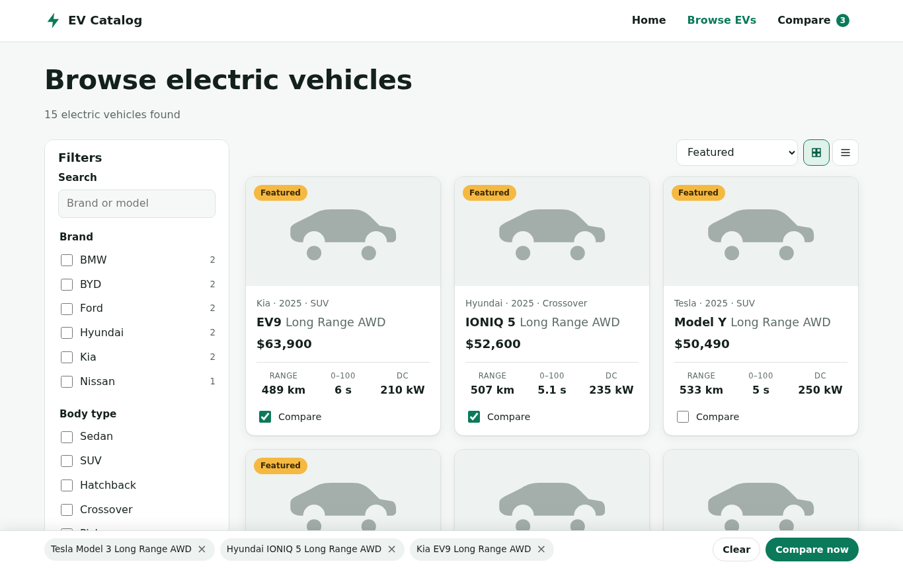 |
| Desktop detail 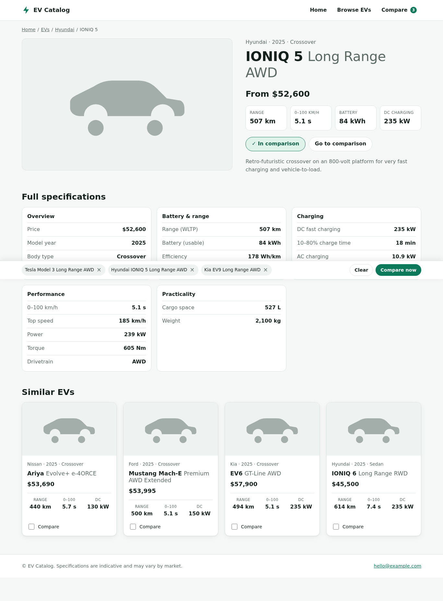 | Desktop compare 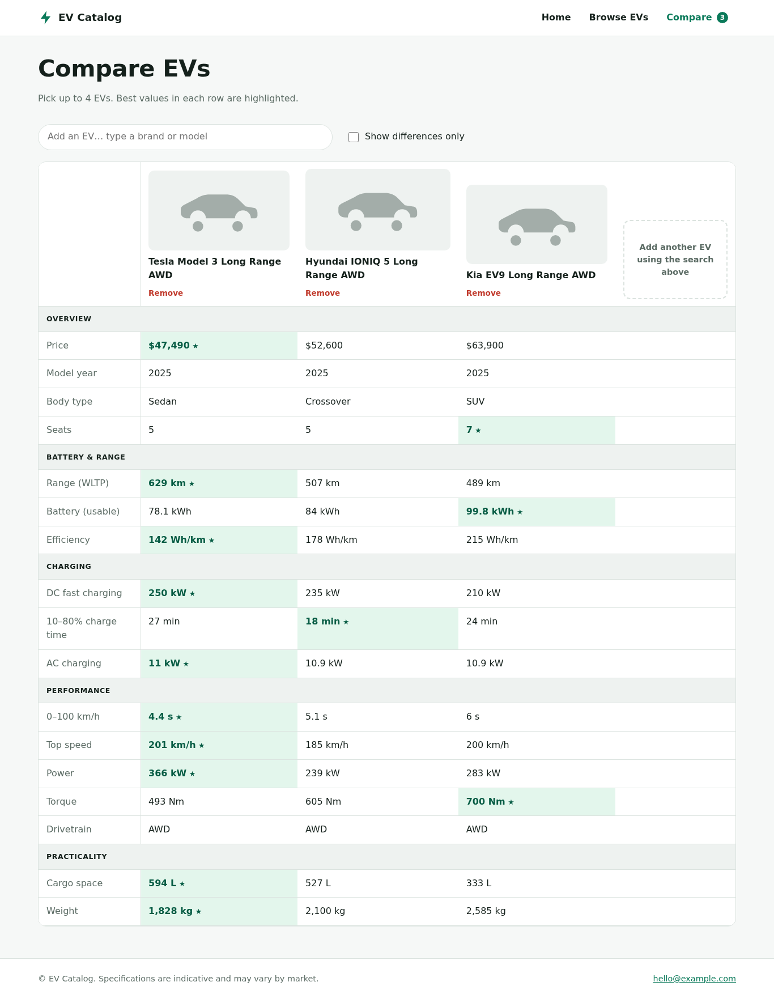 |
| Tablet catalog 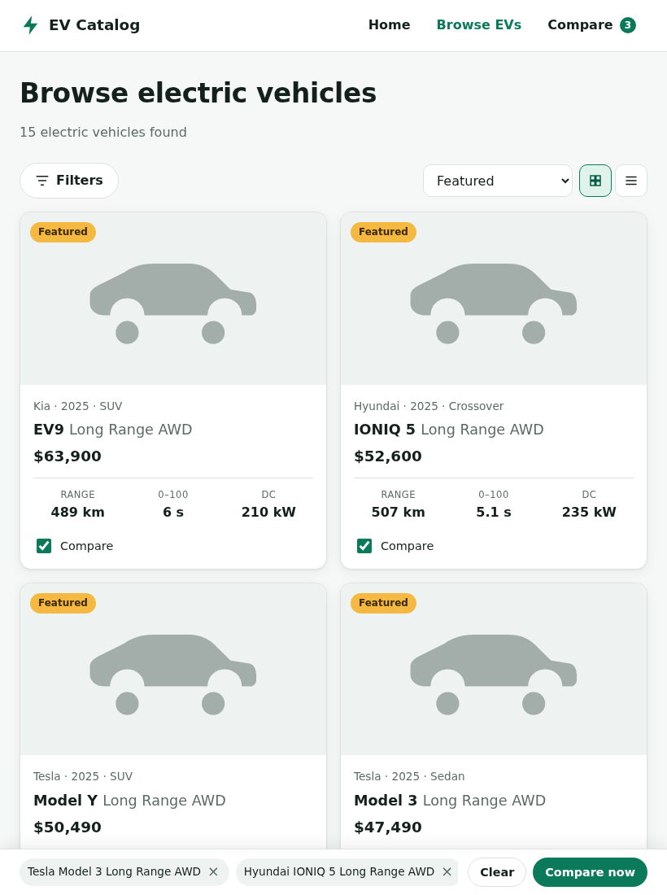 | Mobile home 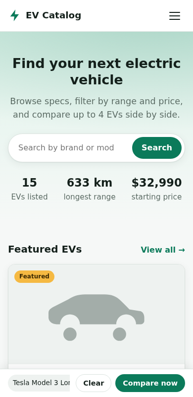 |
| Mobile filter drawer 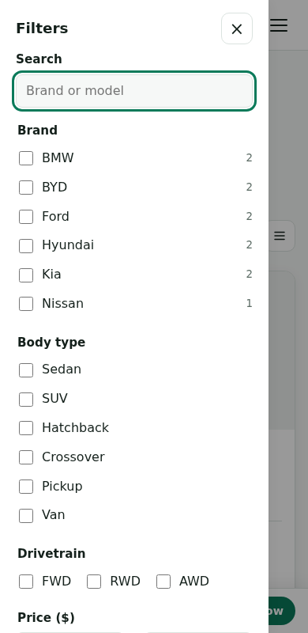 | Mobile compare 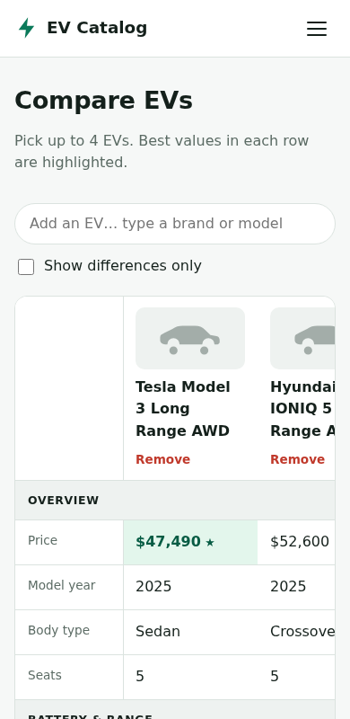 |
| Admin login 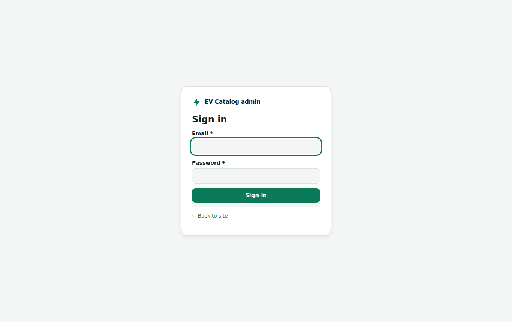 | Admin dashboard 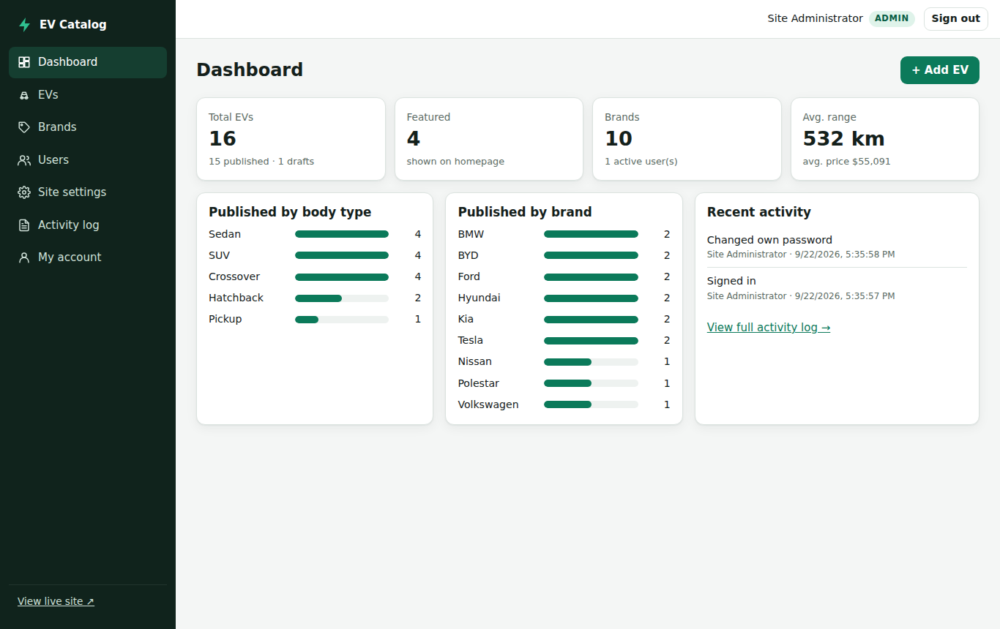 |
| Admin EV list (bulk select) 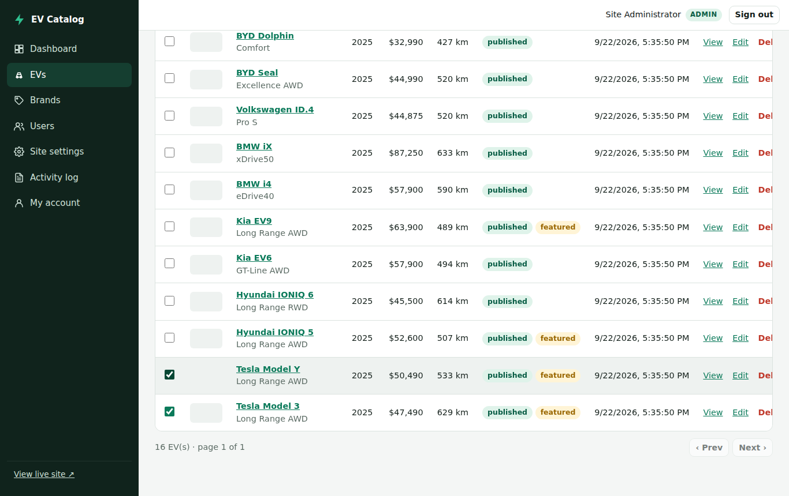 | Admin EV form 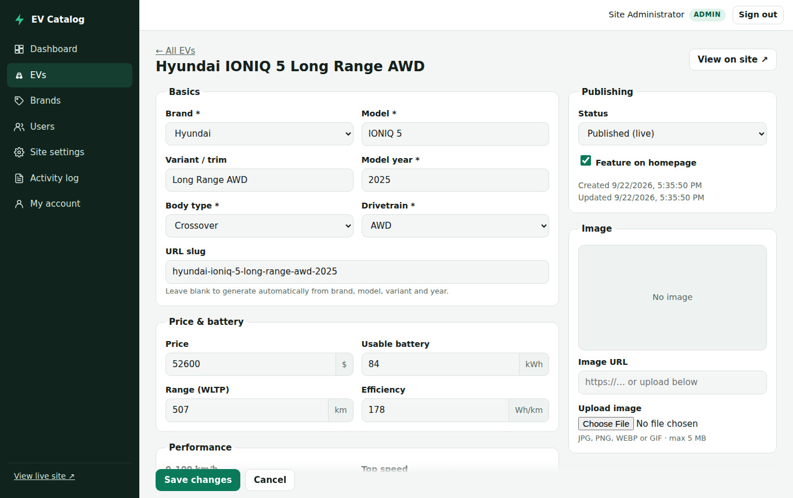 |
| Admin add-user dialog 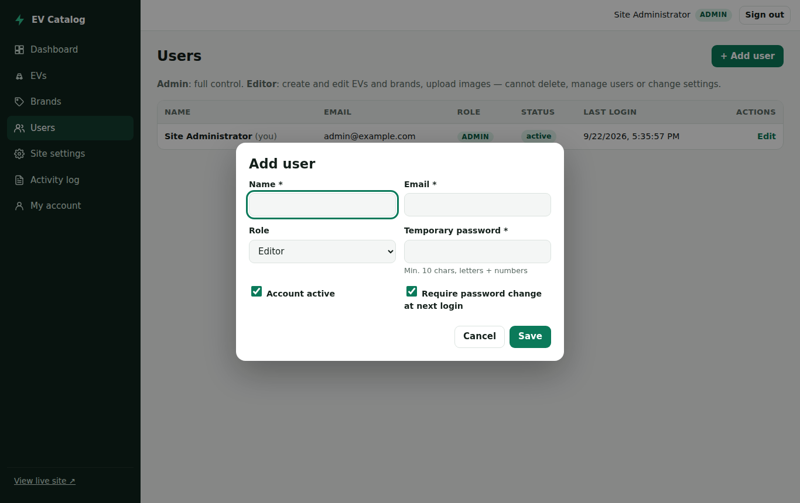 | |
